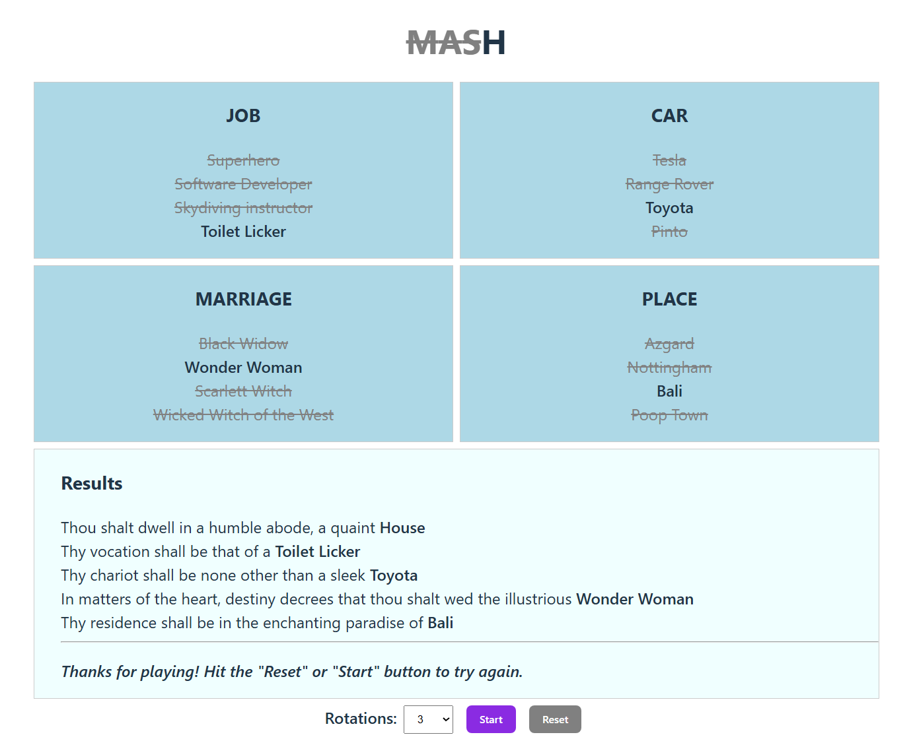

# MASH game

A web app of the children's game "MASH" built with Vue 3 + TypeScript - MVP.



## Features

- Selection (elimination) algorithm
- The sequencing steps of the selection are shown in a slow visual representation to add suspense/fun
- Pre-created options to demo the MVP functionality.
- The final results are presented to the player.

#### Future features

- The player is prompted with the initial MASH questions
- Edit and delete functionality for items/options
- Ability to create own custom sections
- BONUS: ChatGPT support to write final fortune sentence based on result set.

## Project Setup

```sh
npm install
```

### Compile and Hot-Reload for Development

```sh
npm run dev
```
