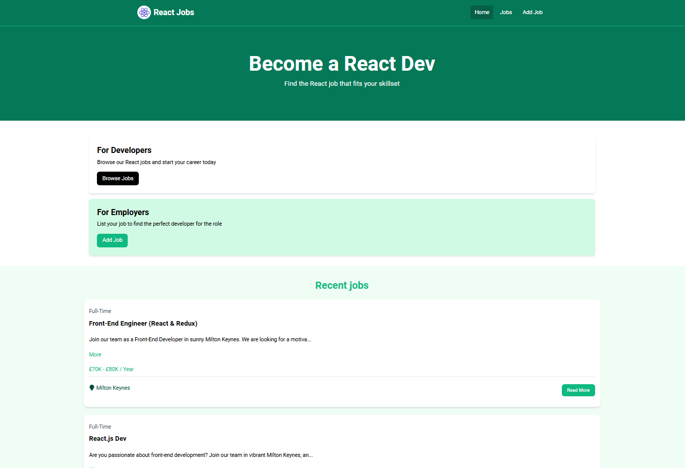

### React Jobs

React practice creating a mock jobs board.



Features

- Home page
- Navaigation
- View list of jobs
- View a job
- Add a job
- Edit a job
- Delete a job

## Usage

This project uses JSON-Server for a mock backend.

### Install Dependencies

```bash
npm install
```

### Run JSON Server

To serve up a mock API, we can use json-server. It will use the data from the `src/jobs.json` file
The server will run on http://localhost:8000

```bash
npm run server
```

### Run Vite Frontend

React will run on http://localhost:3000

```bash
npm run dev
```
