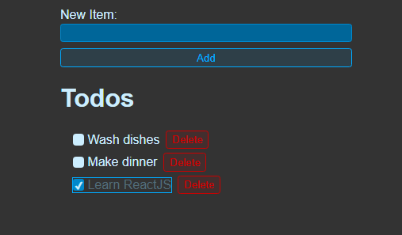

# Todo App

React practice creating a todo app.



Features

- Add new todo item
- View list of todo items
- Delete a todo item

## Usage

### Install Dependencies

```bash
npm install
```

### Run Vite Frontend

React will run on http://localhost:5173

```bash
npm run dev
```
